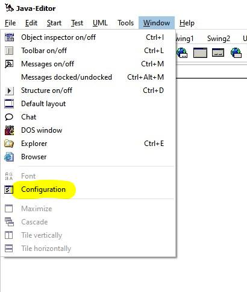
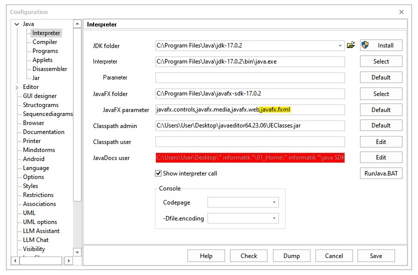

# graph-dracula

## Building it

**Requirements:**
- java
- javafx SDK >= 17

You can get the SDK here: <https://gluonhq.com/products/javafx>

### Linux

After extracting the SDK somewhere sensible and cloning this repository you can compile everything with following commands: 

`cd /path/to/repository/JavaClasses`

`javac -classpath $(pwd) --module-path /path/to/javafx-SDK/lib --add-modules=javafx.controls,javafx.media,javafx.web,javafx.fxml -deprecation -g -encoding UTF-8 *.java`

And run it with the following:

`java -classpath $(pwd) --module-path /path/to/javafx-SDK/lib --add-modules=javafx.controls,javafx.media,javafx.web,javafx.fxml -Dprism.verbose=true Main.java`

### Windows

If you so happen to use the javaeditor (from javaeditor.org) these instructions are for you.

1. Clone this repository.
2. Open the configuration window. 

3. Add **"javafx.fxml"** to the JavaFX parameters, and save. 

4. Open all the .java filese located under C:\path\to\repository\JavaClasses. And compile everything.
5. You should now be able to run the program.

---

To compile everything manually you can run the following in the cmd.

`cd "C:\path\to\repository\JavaClasses"`

`javac -classpath . --module-path "C:\path\to\javafx-SDK\lib" --add-modules=javafx.controls,javafx.media,javafx.web,javafx.fxml -deprecation -g -encoding UTF-8 *.java`

And run it with the following:

`java -classpath . --module-path "C:\path\to\javafx-SDK\lib" --add-modules=javafx.controls,javafx.media,javafx.web,javafx.fxml -Dprism.verbose=true Main.java`
